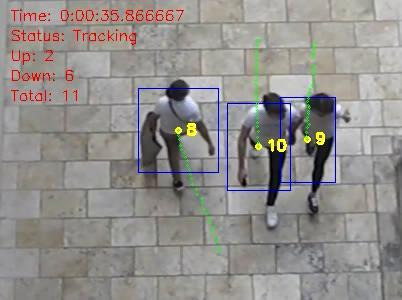
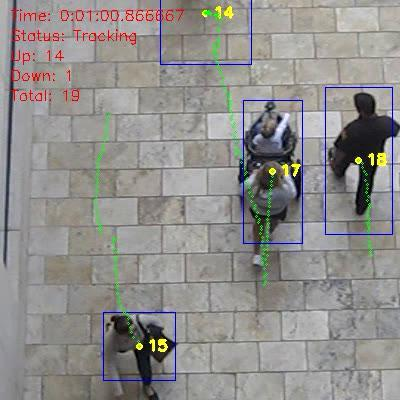

# People Counter

Counting people using OpenCV.

# Usage

* open a command line interface (cmd, terminal, ...)
* clone project `git clone https://github.com/SadraSamadi/people_counter.git`
* go to the project folder `cd people_counter`
* install python packages `pip install -r requirements.txt`
* run the program `python main.py -i <path_to_the_input_video> -o <path_to_the_output_video>`
